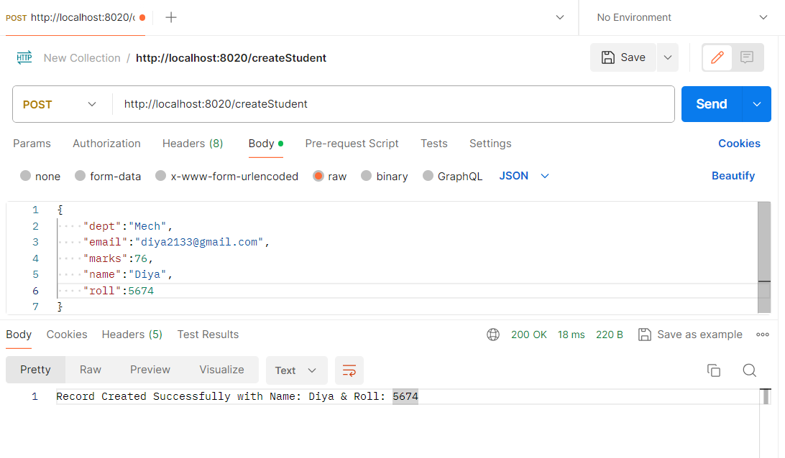
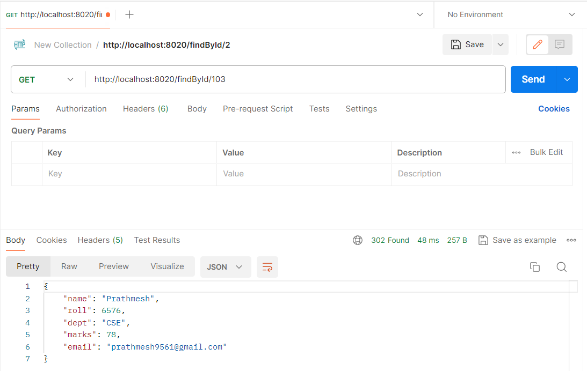
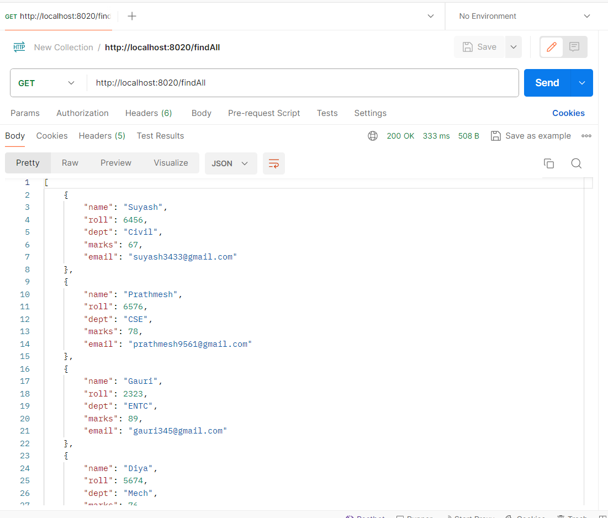
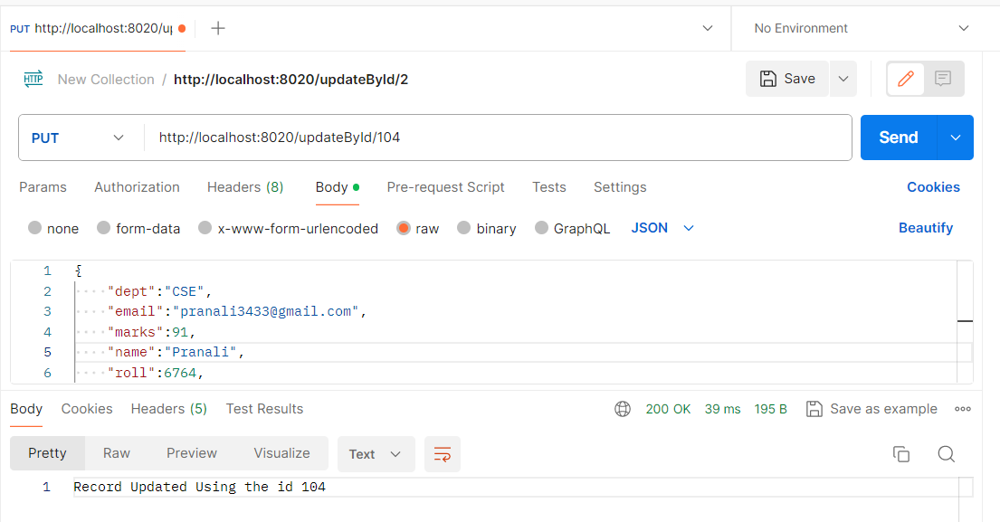
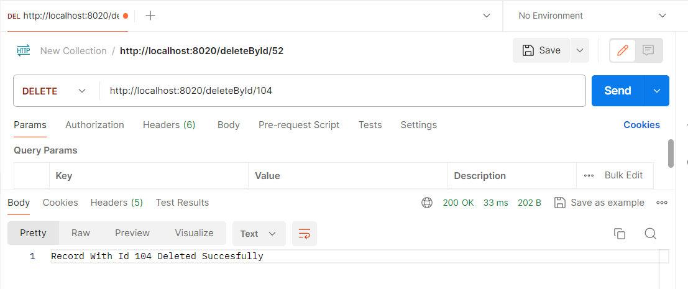
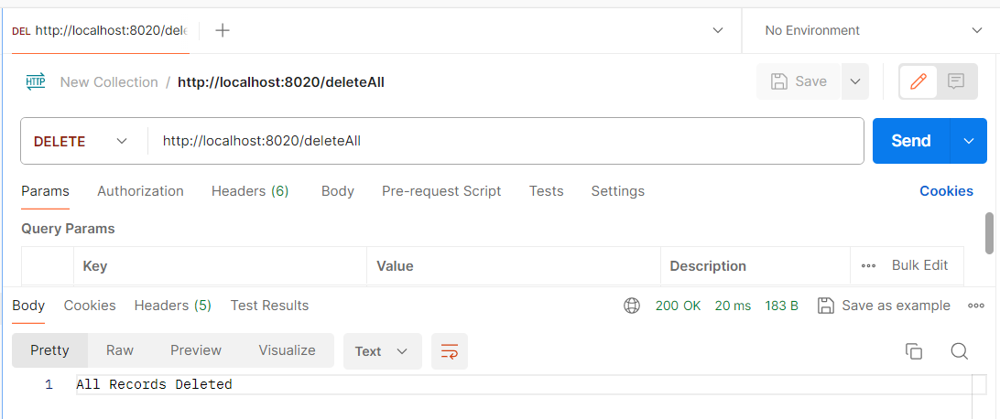

# Student Management CRUD Application

This Spring Boot application provides CRUD (Create, Read, Update, Delete) functionality for managing student records.

## Dependencies Used

- **Spring Boot Web**: For building web applications using Spring MVC.
- **Spring Boot Data JPA**: For easy integration with JPA (Java Persistence API).
- **Spring MySQL**: Database for storing student records during development.

## REST API Endpoints

- **GET /api/students**: Retrieve all students.
- **GET /api/students/{id}**: Retrieve a student by ID.
- **POST /api/students**: Create a new student.
- **PUT /api/students/{id}**: Update an existing student.
- **DELETE /api/students/{id}**: Delete a student by ID.
## Result Screenshots

- **Created A New Student**: 
- **Find Student Data Using Id**: 
- **Display All The Student Records**: 
- **Update Student Info. By Their Id's**: 
- **Delete Student Data Using Id**: 
- **Delete All The Student Records**: 

## Usage

1. Access the application at `http://localhost:8020`.
2. Use the provided REST API endpoints to perform CRUD operations on student records.

## Contributing

Contributions are welcome! Please feel free to submit a pull request.

